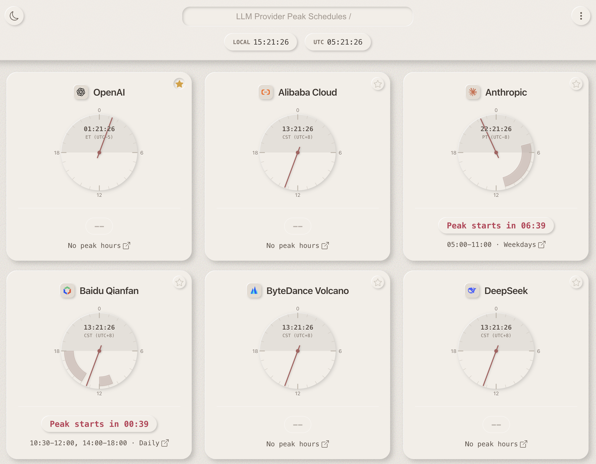
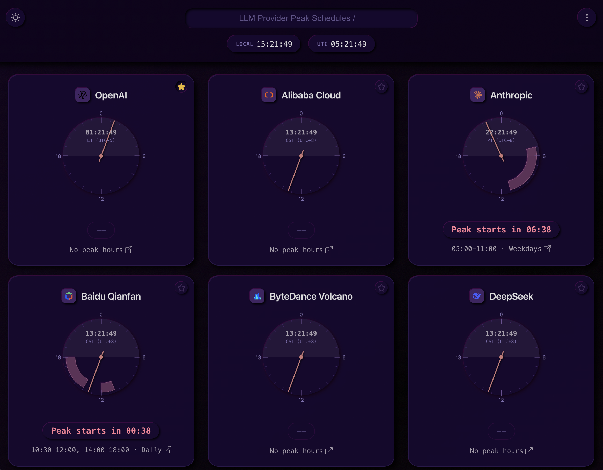

  
  <h1>Peak schedule</h1>
  
Visualize LLM provider peak and non-peak hours at a glance

  
  

    
    
  

## About

Peak schedule is a beautiful, interactive web application that helps you track peak and non-peak hours for various LLM (Large Language Model) providers. Whether you're a developer optimizing API costs or a researcher managing compute resources, Peak schedule provides at-a-glance visibility into when LLM services are likely to be most congested or readily available.

### Features

- 🌙 **Light & Dark Modes** — Beautiful themes that adapt to your preference
- 🕐 **Real-time Clock Display** — Shows local and UTC time for provider regions
- ⭐ **Provider Favoriting** - Mark your frequently used providers for quick access
- 📱 **Responsive Design** — Works seamlessly on desktop and mobile devices
- 🔍 **Provider Search** — Quickly find the provider you need
- 📊 **Visual Peak Indicators** — Color-coded cards show peak/non-peak status at a glance

### Supported Providers

- OpenAI (ChatGPT)
- Anthropic (Claude)
- Google (Gemini)
- DeepSeek
- Moonshot (Kimi)
- iFlytek (Spark)
- Tencent Cloud (Hunyuan)
- Alibaba Cloud (Qwen)
- Baidu Cloud (ERNIE)
- Volcengine (Doubao)
- MiniMax

## Support the Project

If this project is able to help, consider supporting the development:

## Attributions

- **Theme**: [Papermorphic™](https://papermorphic.marco-leong.com/index.html)
- **Icons**: [Bootstrap Icons](https://icons.getbootstrap.com/)

## License

Dual licenses available: [SSPLv1](https://spdx.org/licenses/SSPL-1.0.html) or contact for commercial license.

---

## SEO Keywords

LLM, Large Language Model, API scheduling, peak hours, non-peak hours, API costs, OpenAI, Claude, Gemini, DeepSeek, Kimi, Moonshot, iFlytek, Spark, Tencent Cloud, Hunyuan, Alibaba Cloud, Qwen, Baidu Cloud, ERNIE, Volcengine, Doubao, MiniMax, API optimization, developer tools, AI services, compute scheduling, API availability, LLM provider status, API congestion, off-peak API usage